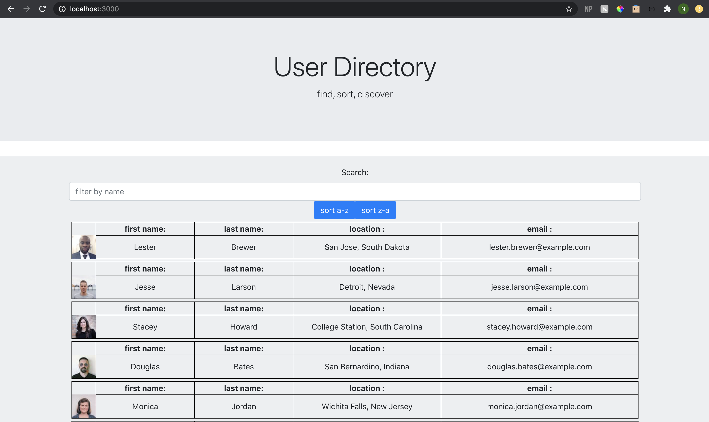
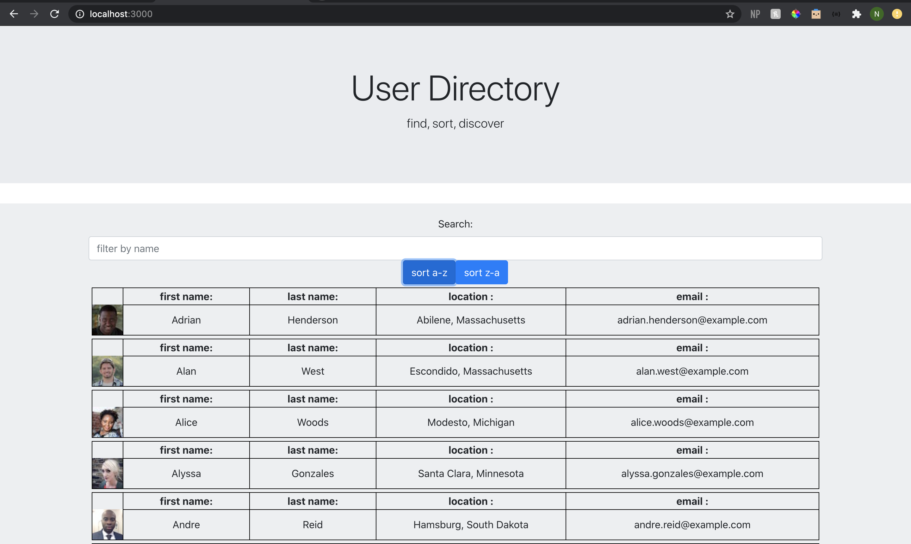
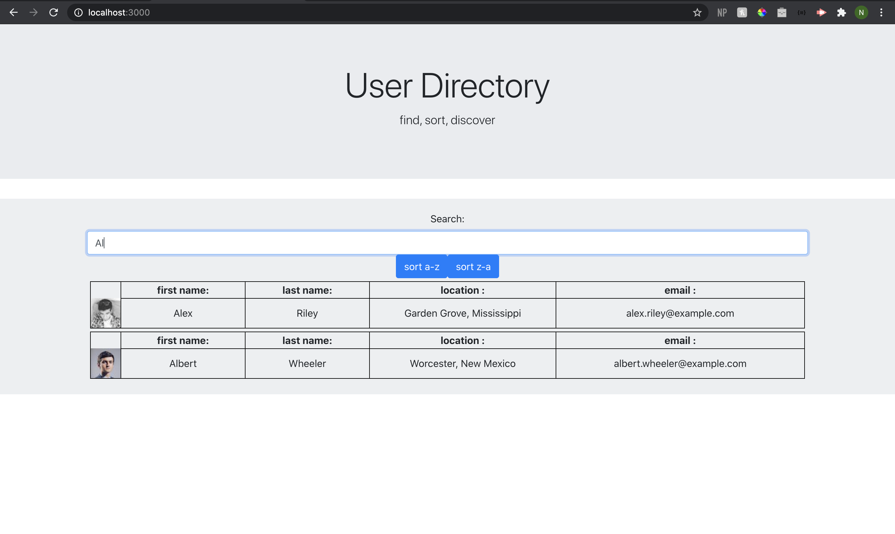

# Employee Directory 
Employee Directory created with React. 

### Description
This application is an employee directory made with React accessing a public random user directory api. 

The user can sort and filter through the employees. 

This application is deployed to Heroku. If you go to the deployed site, you can click the app install to install the application to your computer. 

    
## Table of Contents
1. [Installation](#installation)
2. [Usage](#usage)
3. [License](#license)
4. [Contributing](#contributing)
5. [Tests](#tests)
6. [Questions](#questions)

### Images of Employee Profile Process

### Landing Page

### Sort

### Filter

### Installation
This is a React App - make sure to npm install the dependencies.  

### Usage
This application can be used to filter sort users in a directory. 

### License 

This application is covered under MIT.

### Contributing 
Pull requests are welcome. For major changes, please open an issue first to discuss what you would like to change.

### Tests
Please make sure to update tests as appropriate.

### Questions
1. [Github](https://github.com/nicoleremy95/employeedirectory)

### Link to Deployed Application
1. [Employee Directory](https://ner-budget-tracker.herokuapp.com/)
    
     